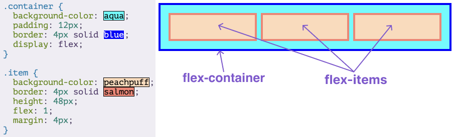

# Flexbox

Flexbox is a way to arrange items into rows or columns. These items will flex based on some rules that you can define.

It is not just a single CSS property but a whole toolbox of properties

Some of these properties belong on the flex container, while some go on the flex items.

A flex container is any element that has `display: flex` on it. A flex item is any element that lives directly inside of a flex container.

The following image was achieved using only flexbox to arrange, size, and place the various elements.

## Knowledge check

* What’s the difference between a flex container and a flex item?

A flex container has `display: flex` on it. A flex item is a child to a flex container.

* How do you create a flex item?

Put this item inside a flex container.

## Additional good resources

* <a href="https://internetingishard.netlify.app/html-and-css/flexbox/index.html">Interneting is Hard</a>: Friendly web development tutorials for complete beginners. It’s 100% Free.

* <a href="https://www.youtube.com/watch?v=phWxA89Dy94">Slaying the Dragon 8 min video on Flexbox.</a>
