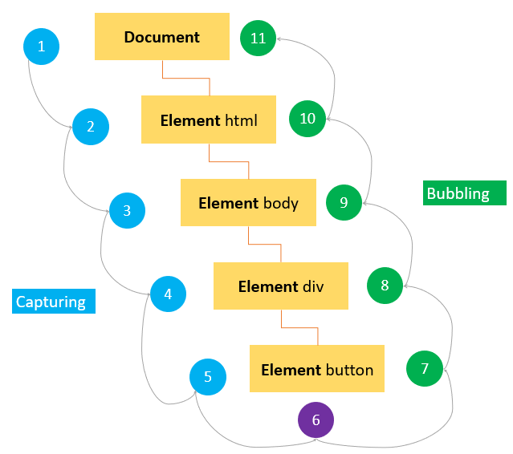
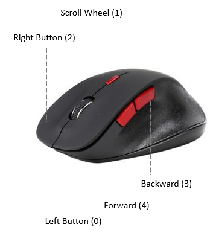
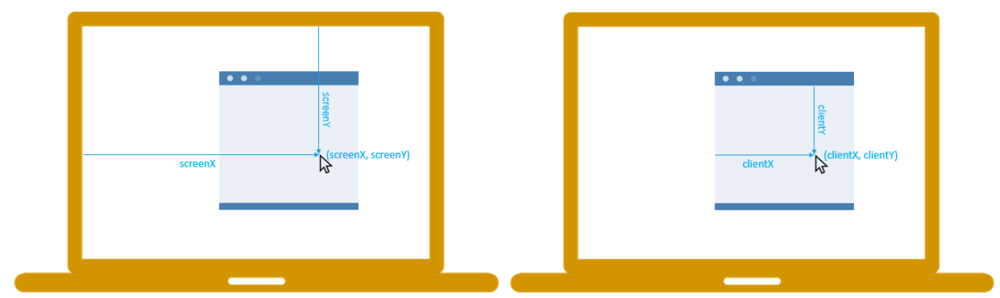

# DOM Manipulation and Events

The DOM (or Document Object Model) is a tree-like representation of the contents of a webpage - a tree of “nodes” with different relationships depending on how they’re arranged in the HTML document. There are many types of nodes, most of which are not commonly used. In this lesson we will be focusing on “element” nodes which are primarily used for manipulating the DOM.

```html
<div id="container">
  <div class="display"></div>
  <div class="controls"></div>
</div>
```

When working with the DOM, you use “selectors” to target the nodes you want to work with. You can use a combination of CSS-style selectors and relationship properties to target the nodes you want. Let’s start with CSS-style selectors. In the above example, you could use the following selectors to refer to `<div class="display"></div>`:
* div.display
* .display
* #container > .display
* div#container > div.display

You can also use relational selectors (i.e., firstElementChild or lastElementChild, etc.) with special properties owned by the nodes.
```js
// selects the #container div (don't worry about the syntax, we'll get there)
const container = document.querySelector("#container");

// selects the first child of #container => .display
const display = container.firstElementChild;
console.log(display);  // <div class="display"></div>
```

```js
// selects the .controls div
const controls = document.querySelector(".controls");

// selects the prior sibling => .display
const display = controls.previousElementSibling;
console.log(display); // <div class="display"></div>
```
So you’re identifying a certain node based on its relationships to the nodes around it.

### DOM Methods

When your HTML code is parsed by a web browser, it is converted to the DOM, as was mentioned above. One of the primary differences is that these nodes are JavaScript objects that have many properties and methods attached to them. These properties and methods are the primary tools we are going to use to manipulate our webpage with JavaScript.

Query selectors:

* element.querySelector(selector) - returns a reference to the first match of selector.

* element.querySelectorAll(selectors) - returns a “NodeList” containing references to all of the matches of the selectors.

It’s important to remember that when using `querySelectorAll`, the return value is not an array. It looks like an array, and it somewhat acts like an array, but it’s really a “NodeList”. The big distinction is that several array methods are missing from NodeLists. One solution, if problems arise, is to convert the NodeList into an array. You can do this with `Array.from()` or the <a href="https://developer.mozilla.org/en-US/docs/Web/JavaScript/Reference/Operators/Spread_operator" target="_blank" rel="noopener noreferrer">spread operator</a>.

#### Element creation

```js
const div = document.createElement("div");
```

This function does NOT put your new element into the DOM - it creates it in memory. This is so that you can manipulate the element (by adding styles, classes, ids, text, etc.) before placing it on the page. You can place the element into the DOM with one of the following methods.

#### Append element

* `parentNode.appendChild(childNode)` - appends `childNode` as the last child of parentNode.

* `parentNode.insertBefore(newNode, referenceNode)` - inserts `newNode` into `parentNode` before `referenceNode`.

#### Remove elements

* `parentNode.removeChild(child)` - removes `child` from `parentNode` on the DOM and returns a reference to `child`.

#### Altering elements

##### Adding inline style

```js
// adds the indicated style rule to the element in the div variable
div.style.color = "blue";

// adds several style rules
div.style.cssText = "color: blue; background: white;";

// adds several style rules
div.setAttribute("style", "color: blue; background: white;");
```

##### Editing attributes

```js
// if id exists, update it to 'theDiv', else create an id with value "theDiv"
div.setAttribute("id", "theDiv");

// returns value of specified attribute, in this case "theDiv"
div.getAttribute("id");

// removes specified attribute
div.removeAttribute("id");
```

##### Adding text content

```js
// creates a text node containing "Hello World!" and inserts it in div
div.textContent = "Hello World!";
```

##### Adding HTML content

```js
// renders the HTML inside div
div.innerHTML = "<span>Hello World!</span>";
```

Note that using textContent is preferred over innerHTML for adding text, as innerHTML should be used sparingly to avoid potential security risks. To understand the dangers of using innerHTML, watch this <a href="https://youtube.com/watch?v=ns1LX6mEvyM" target="_blank" rel="noopener noreferrer">video about preventing the most common cross-site scripting attack</a>.

#### Example:

```html
<!-- your HTML file: -->
<body>
  <h1>THE TITLE OF YOUR WEBPAGE</h1>
  <div id="container"></div>
</body>
```

```js
// your JavaScript file
const container = document.querySelector("#container");

const content = document.createElement("div");
content.classList.add("content");
content.textContent = "This is the glorious text-content!";

container.appendChild(content);
```

After the JavaScript code is run, our DOM tree will look like this:
```html
<!-- The DOM -->
<body>
  <h1>THE TITLE OF YOUR WEBPAGE</h1>
  <div id="container">
    <div class="content">This is the glorious text-content!</div>
  </div>
</body>
```

Keep in mind that the JavaScript does not alter your HTML, but the DOM - your HTML file will look the same, but the JavaScript changes what the browser renders.

Your JavaScript, for the most part, is run whenever the JS file is run or when the script tag is encountered in the HTML. If you are including your JavaScript at the top of your file, many of these DOM manipulation methods will not work because the JS code is being run *before* the nodes are created in the DOM. The simplest way to fix this is to include your JavaScript at the bottom of your HTML file so that it gets run after the DOM nodes are parsed and created.

Alternatively, you can link the JavaScript file in the `<head>` of your HTML document. Use the `<script>` tag with the `src` attribute containing the path to the JS file, and include the `defer` keyword to load the file *after* the HTML is parsed, as such:

```js
<head>
  <script src="js-file.js" defer></script>
</head>
```

The `defer` attribute tells the browser not to wait for the script. Instead, the browser will continue to process the HTML, build DOM. The script loads “in the background”, and then runs when the DOM is fully built.

#### Exercise :white_check_mark:

Copy the example above into files on your own computer. To make it work, you’ll need to supply the rest of the HTML skeleton and either link your JavaScript file or put the JavaScript into a script tag on the page. Make sure everything is working before moving on!

Add the following elements to the container using ONLY JavaScript and the DOM methods shown above:


* a `` with red text that says “Hey I’m red!”
* an `<h3>` with blue text that says “I’m a blue h3!”
* a `<div>` with a black border and pink background color with the following elements inside of it:
  - another `<h1>` that says “I’m in a div”
  - a `` that says “ME TOO!”
  - Hint for this one: after creating the `<div>` with createElement, append the `<h1>` and `` to it before adding it to the container.

### Events

Events are actions that occur on your webpage, such as mouse-clicks or key-presses. Using JavaScript, we can make our webpage listen to and react to these events.

There are three primary ways to go about this:

* You can specify function attributes directly on your HTML elements.
* You can set properties in the form of on<eventType>, such as onclick or onmousedown, on the DOM nodes in your JavaScript.
* You can attach event listeners to the DOM nodes in your JavaScript.

We’re going to create three buttons that all alert “Hello World” when clicked.

#### Method 1

```js
<button onclick="alert('Hello World')">Click Me</button>
```
This solution is less than ideal because we’re cluttering our HTML with JavaScript. Also, we can only set one “onclick” property per DOM element, so we’re unable to run multiple separate functions in response to a click event using this method.

```html
<!-- the HTML file -->
<button id="btn">Click Me</button>
```

#### Method 2

```js
// the JavaScript file
const btn = document.querySelector("#btn");
btn.onclick = () => alert("Hello World");
```
This is a little better. We’ve moved the JS out of the HTML and into a JS file, but we still have the problem that a DOM element can only have one “onclick” property.

#### Method 3

```html
<!-- the HTML file -->
<button id="btn">Click Me Too</button>
```

```js
// the JavaScript file
const btn = document.querySelector("#btn");
btn.addEventListener("click", () => {
  alert("Hello World");
});
```
Now, we maintain separation of concerns, and we also allow multiple event listeners if the need arises. Method 3 is much more flexible and powerful, though it is a bit more complex to set up.


With all three methods, we can access more information about the event by passing a parameter to the function that we are calling. Try this out on your own machine:
```js
btn.addEventListener("click", function (e) {
  console.log(e);
});
```

The `e` parameter in that callback function contains an object that references the **event** itself. Within that object you have access to many useful properties and methods (functions that live inside an object) such as which mouse button or key was pressed, or information about the event’s **target** - the DOM node that was clicked. JavaScript knows the parameter is an event because an event listener callback takes an `Event` object by definition. When the callback is run, the event handler passes in its own reference to the event. You can read more about the event objects on <a href="https://developer.mozilla.org/en-US/docs/Learn_web_development/Core/Scripting/Events#event_objects" target="_blank" rel="noopener noreferrer">MDN’s introduction to events</a>.

#### Attaching listeners to groups of nodes

We learned above that we can get a NodeList of all of the items matching a specific selector with `querySelectorAll('selector')`. In order to add a listener to each of them, we need to iterate through the whole list, like so:
```html
<div id="container">
  <button id="one">Click Me</button>
  <button id="two">Click Me</button>
  <button id="three">Click Me</button>
</div>
```

```js
// buttons is a node list. It looks and acts much like an array.
const buttons = document.querySelectorAll("button");

// we use the .forEach method to iterate through each button
buttons.forEach((button) => {
  // and for each one we add a 'click' listener
  button.addEventListener("click", () => {
    alert(button.id);
  });
});
```

## Assignment

Manipulating web pages is the primary benefit of the JavaScript language! These techniques are things that you are likely to be messing with <em>every day</em> as a front-end developer, so let’s practice!


1. Complete <a href="https://developer.mozilla.org/en-US/docs/Learn/JavaScript/Client-side_web_APIs/Manipulating_documents#active_learning_basic_dom_manipulation" target="_blank" rel="noopener noreferrer">MDN’s Active Learning sections on DOM manipulation</a> to test your skills! :white_check_mark:

2. Read the following sections from JavaScript Tutorial’s series on the DOM to get a broader idea of how events can be used in your pages. Note that some of the methods like `getElementById` are older and see less use today.

As you read, remember that the general ideas can be applied to any event, not only the ones used in examples - but information specific to a certain event type can always be found by checking documentation.
* <a href="https://www.javascripttutorial.net/javascript-dom/javascript-events/" target="_blank" rel="noopener noreferrer">JavaScript events</a> :white_check_mark:
* <a href="https://www.javascripttutorial.net/javascript-dom/javascript-page-load-events/" target="_blank" rel="noopener noreferrer">Page load events</a> :white_check_mark:
* <a href="https://www.javascripttutorial.net/javascript-dom/javascript-mouse-events/" target="_blank" rel="noopener noreferrer">Mouse events</a> :white_check_mark:
* <a href="https://www.javascripttutorial.net/javascript-dom/javascript-keyboard-events/" target="_blank" rel="noopener noreferrer">Keyboard events</a> :white_check_mark:
* <a href="https://www.javascripttutorial.net/javascript-dom/javascript-event-delegation/" target="_blank" rel="noopener noreferrer">Event delegation</a> :white_check_mark:
* <a href="https://www.javascripttutorial.net/javascript-dom/javascript-dispatchevent/" target="_blank" rel="noopener noreferrer">The dispatchEvent method</a> :white_check_mark:
* <a href="https://www.javascripttutorial.net/javascript-dom/javascript-custom-events/" target="_blank" rel="noopener noreferrer">Custom events</a> :white_check_mark:

## Knowledge check

* What is the DOM?

Document Object Model. It is how the browser interprets the webpage, with a tree-like structure.

* How do you target the nodes you want to work with?

With `let elem = document.querySelector("string")`, where `string` is a CSS like query.

* How do you create an element in the DOM?

With `let elem = document.createElement("type.class#id")`

* How do you add an element to the DOM?

With `parentNode.appendChild(elem)`.

* How do you remove an element from the DOM?

With `parentNode.removeChild(elem)`.

* How can you alter an element in the DOM?

With `div.style.backgroundColor = 'yellow'`.

* When adding text to a DOM element, should you use textContent or innerHTML? Why?

You should use `textContent`, because `innerHTML` can be vulnerable to XSS attacks.

* Where should you include your JavaScript tag in your HTML file when working with DOM nodes?

At the end of the file, or with `defer`, because it has to execute after the DOM is created.

* How do “events” and “listeners” work?

Events are actions, such as clicks or presses, occuring on the page. Listeners are added to DOM elements, and they "listen" if an event happens on them.

* What are three ways to use events in your code?

Directly on HTML: `<button onclick="alert('Hello World')">Click Me</button>`.

Setting properties `on<eventType>`, such as `btn.onclick = () => alert("Hello World")`.

Adding event listeners: `btn.addEventListener("click", () => { alert("Hello World"); })`.

* Why are event listeners the preferred way to handle events?

We can add multiple event listeners if the need arises. It is much more flexible and powerful.

* What are the benefits of using named functions in your listeners?

Having a cleaner code.

* How do you attach listeners to groups of nodes?

You query all of them with `querySelectorAll()` and do a for loop like:
```js
buttons.forEach((button) => {
  button.addEventListener("click", () => {
    alert(button.id);
  });
});
```

* What is the difference between the return values of querySelector and querySelectorAll?

The `querySelector` only returns the first match, and `querySelectorAll` returns all matches in a NodeList.

* What does a “NodeList” contain?

A list of references to DOM nodes.

* Explain the difference between “capture” and “bubbling”.

Capturing an event happens from the outermost element to the innermost element where the event happened in the DOM tree. Bubbling is the other director, the innermost to the outermost.


## Additional resources

* <a href="http://eloquentjavascript.net/13_dom.html" target="_blank" rel="noopener noreferrer">Eloquent JS - DOM</a>
* <a href="http://eloquentjavascript.net/14_event.html" target="_blank" rel="noopener noreferrer">Eloquent JS - Handling Events</a>
* <a href="https://plainjs.com/javascript/" target="_blank" rel="noopener noreferrer">Plain JavaScript</a> is a reference of JavaScript code snippets and explanations involving the DOM, as well as other aspects of JS. If you’ve already learned jQuery, it will help you figure out how to do things without it.
* This <a href="https://www.w3schools.com/js/js_htmldom.asp" target="_blank" rel="noopener noreferrer">W3Schools</a> article offers easy-to-understand lessons on the DOM.
* <a href="https://www.youtube.com/watch?v=0ik6X4DJKCc&amp;list=PLillGF-RfqbYE6Ik_EuXA2iZFcE082B3s" target="_blank" rel="noopener noreferrer">JS DOM Crash Course</a> is an extensive and well explained 4 part video series on the DOM by Traversy Media.
* <a href="https://www.digitalocean.com/community/tutorial_series/understanding-the-dom-document-object-model" target="_blank" rel="noopener noreferrer">Understanding The Dom</a> is an aptly named article-based tutorial series by DigitalOcean.
* <a href="https://developer.mozilla.org/en-US/docs/Learn/JavaScript/Building_blocks/Events" target="_blank" rel="noopener noreferrer">Introduction to events</a> by MDN covers the same topics you learned in this lesson on events.
* <a href="https://www.youtube.com/watch?v=VuN8qwZoego" target="_blank" rel="noopener noreferrer">Wes Bos’s Drumkit</a> JavaScript30 program reinforces the content covered in the assignment. In the video you will notice that a deprecated <a href="https://developer.mozilla.org/en-US/docs/Web/API/KeyboardEvent/keyCode" target="_blank" rel="noopener noreferrer">keycode</a> keyboard event is used, replace it with the recommended <a href="https://developer.mozilla.org/en-US/docs/Web/API/KeyboardEvent/code" target="_blank" rel="noopener noreferrer">code</a> keyboard event and replace the `data-key` tags accordingly.
* <a href="https://www.youtube.com/watch?v=F1anRyL37lE" target="_blank" rel="noopener noreferrer">Event Capture, Propagation and Bubbling video</a> from Wes Bos’s JavaScript30 program.
* <a href="https://dev.to/i3uckwheat/understanding-callbacks-2o9e" target="_blank" rel="noopener noreferrer">Understanding Callbacks in JavaScript</a> for a more in-depth understanding of callbacks.

## More theory

### Page load events

When you open the page:

* `DOMContentLoaded` – the browser fully loaded HTML and completed building the DOM tree. However, it hasn’t loaded external resources like stylesheets and images. In this event, you can start selecting DOM nodes or initialize the interface.
* `load` – the browser fully loaded the HTML and external resources like images and stylesheets.</ul>

When you leave the page:

* `beforeunload` – fires before the page and resources are unloaded. You can use this event to show a confirmation dialog to confirm if you want to leave the page. By doing this, you can prevent data loss in case the user is filling out a form and accidentally clicks a link that navigates to another page.
* `unload` – fires when the page has completely unloaded. You can use this event to send the analytic data or to clean up resources.</ul>

```js
document.addEventListener('DOMContentLoaded',() => {
    // handle DOMContentLoaded event
});

document.addEventListener('load',() => {
    // handle load event
});

document.addEventListener('beforeunload',() => {
    // handle beforeunload event
});

document.addEventListener('unload',() => {
    // handle unload event
});
```

```html
<!DOCTYPE html>
<html>
<head>
    <title>JS Page Load Events</title>
</head>

<body>
    <script>
        addEventListener('DOMContentLoaded', (event) => {
            console.log('The DOM is fully loaded.');
        });

        addEventListener('load', (event) => {
            console.log('The page is fully loaded.');
        });

        addEventListener('beforeunload', (event) => {
            // show the confirmation dialog
            event.preventDefault();
            // Google Chrome requires returnValue to be set.
            event.returnValue = '';
        });

        addEventListener('unload', (event) => {
            // send analytic data
        });
    </script>
</body>
</html>
```

### Mouse events

#### `click`

When you `click` an element, there are no less than three mouse events fire in the following sequence:

1. The `mousedown` fires when you press the mouse button on the element.
2. The `mouseup` fires when you release the mouse button on the element.
3. The `click` fires when one `mousedown` and one `mouseup` detected on the element.

If you press the mouse button on an element, move your mouse cursor off the element, and then release the mouse button. The only `mousedown` event fires on the element.

Likewise, if you press the mouse button, move the mouse over the element, and release the mouse button, the only `mouseup` event fires on the element.

In both cases, the `click` event never fires.

It takes two click events to cause a `dblclick` event to fire.

#### `mousemove`

The `mousemove` event fires repeatedly whenever you move the mouse cursor around an element. This `mousemove` event fires many times per second as the mouse is moved around, even if it is just by one pixel. This may lead to a performance issue if the event handler function is complex.

To avoid the performance issue, it is a good practice to add `mousemove` event handler only when you need it and remove it as soon as it is no longer needed, like this:
```js
element.onmousemove = mouseMoveEventHandler;
// ...
//  later, no longer use
element.onmousemove = null;
```

#### `mouseover/mouseout`

The `mouseover` fires when the mouse cursor is outside of the element and then moves inside the boundaries of the element.

The `mouseout` fires when the mouse cursor is over an element and then moves another element.

#### `mouseenter / mouseleave`

The `mouseenter` fires when the mouse cursor is outside of an element and then moves inside the boundaries of the element.

The `mouseleave` fires when the mouse cursor is over an element and then moves to the outside of the element’s boundaries.

Both `mouseenter` and `mouseleave` does not bubble and does not fire when the mouse cursor moves over descendant elements.

#### Detecting mouse buttons

The `event` object passed to the mouse event handler has a property called `button` that indicates which mouse button was pressed on the mouse to trigger the event.

The mouse button is represented by a number:

0. Main mouse button => Left.
1. Auxiliary button is pressed => Middle or Wheel.
2. Secondary button is pressed => Right.
3. Fourth button => Browser Back button.
4. Fifth button => Browser Forward button.



```html
<!DOCTYPE html>
<html>
<head>
    <title>JS Mouse Events - Button Demo</title>
</head>
<body>
    <button id="btn">Click me with any mouse button: left, right, middle, ...</button>
    <p id="message"></p>
    <script>
        let btn = document.querySelector('#btn');

        // disable context menu when right-mouse clicked
        btn.addEventListener('contextmenu', (e) => {
            e.preventDefault();
        });

        // show the mouse event message
        btn.addEventListener('mouseup', (e) => {
            let msg = document.querySelector('#message');
            switch (e.button) {
                case 0:
                    msg.textContent = 'Left mouse button clicked.';
                    break;
                case 1:
                    msg.textContent = 'Middle mouse button clicked.';
                    break;
                case 2:
                    msg.textContent = 'Right mouse button clicked.';
                    break;
                default:
                    msg.textContent = `Unknown mouse button code: ${event.button}`;
            }
        });
    </script>
</body>
</html>
```

#### Modifier keys

When you click an element, you may press one or more modifier keys: `Shift`, `Ctrl`, `Alt`, and `Meta`.

The `Meta` key is the Windows key on Windows keyboards and the `Command` key on the Apple keyboard.

The `event` object has four Boolean properties, where each is set to `true` if the key is being held down or `false` if the key is not pressed.

```html
<!DOCTYPE html>
<html>
<head>
    <title>JS Modifier Keys Demo</title>
</head>
<body>
    <button id="btnKeys">Click me with Alt, Shift, Ctrl pressed</button>
    <p id="messageKeys"></p>

    <script>
        let btnKeys = document.querySelector('#btnKeys');

        btnKeys.addEventListener('click', (e) => {
            let keys = [];

            if (e.shiftKey) keys.push('shift');
            if (e.ctrlKey) keys.push('ctrl');
            if (e.altKey) keys.push('alt');
            if (e.metaKey) keys.push('meta');

            let msg = document.querySelector('#messageKeys');
            msg.textContent = `Keys: ${keys.join('+')}`;
        });
    </script>
</body>
</html>
```

#### Getting Screen Coordinates

The `screenX` and `screenY` properties of the event passed to the mouse event handler return the screen coordinates of the location of the mouse in relation to the entire screen.

On the other hand, the `clientX` and `clientY` properties provide the horizontal and vertical coordinates within the application’s client area at which the mouse event occurred:



```html
<!DOCTYPE html>
<html>
<head>
    <title>JS Mouse Location Demo</title>
    <style>
        #track {
            background-color: goldenrod;
            height: 200px;
            width: 400px;
        }
    </style>
</head>
<body>
    <p>Move your mouse to see its location.</p>
    <div id="track"></div>
    <p id="log"></p>

    <script>
        let track = document.querySelector('#track');
        track.addEventListener('mousemove', (e) => {
            let log = document.querySelector('#log');
            log.innerText = `
            Screen X/Y: (${e.screenX}, ${e.screenY})
            Client X/Y: (${e.clientX}, ${e.clientY})`
        });
    </script>
</body>
</html>
```

### Keyboard events

When you interact with the keyboard, the keyboard events are fired. There are three main keyboard events:

* `keydown` – fires when you press a key on the keyboard and fires repeatedly while you’re holding down the key.
* `keyup` – fires when you release a key on the keyboard.
* `keypress` – fires when you press a character keyboard like `a`,`b`, or `c`, not the left arrow key, home, or end keyboard, ... The `keypress` also fires repeatedly while you hold down the key on the keyboard.

When you press a character key once on the keyboard, three keyboard events are fired in the following order:
1. `keydown`
2. `keypress`
3. `keyup`

Both `keydown` and `keypress` events are fired before any change is made to the text box, whereas the `keyup` event fires after the changes have been made to the text box. If you hold down a character key, the `keydown` and `keypress` are fired repeatedly until you release the key.

When you press a non-character key, the `keydown` event is fired first followed by the `keyup` event. If you hold down the non-character key, the `keydown` is fired repeatedly until you release the key.

#### The keyboard event properties

The keyboard event has two important properties: `key` and `code`. The key property returns the character that has been pressed whereas the `code` property returns the physical key code.

For example, if you press the `z` character key, the `event.key` returns `"z"` and `event.code` returns `"KeyZ"`.

```html
<!DOCTYPE html>
<html>
<head>
    <title>JavaScript Keyboard Events: Key/Code</title>
</head>
<body>
    <input type="text" id="message">

    <script>
        let textBox = document.querySelector('#message');
        textBox.addEventListener('keydown', (event) => {
            console.log(`key=${event.key},code=${event.code}`);

        });
    </script>
</body>
</html>
```

#### Event delegation

JavaScript event delegation adds a single event handler to the parent element instead of having to register multiple event handlers to the child elements.

Suppose that you have the following menu:
```html
<ul id="menu">
    <li><a id="home">home</a></li>
    <li><a id="dashboard">Dashboard</a></li>
    <li><a id="report">report</a></li>
</ul>
```

```js
let home = document.querySelector('#home');
home.addEventListener('click',(event) => {
    console.log('Home menu item was clicked');
});

let dashboard = document.querySelector('#dashboard');
dashboard.addEventListener('click',(event) => {
    console.log('Dashboard menu item was clicked');
});

let report = document.querySelector('#report');
report.addEventListener('click',(event) => {
    console.log('Report menu item was clicked');
});
```

In JavaScript, if you have a large number of event handlers on a page, these event handlers will directly impact the performance because of the following reasons:

* First, each event handler is a function which is also an object that takes up memory.
* Second, it takes time to assign all the event handlers.

To solve this issue, you can leverage the event bubbling. Instead of having multiple event handlers, you can assign a single event handler to handle all the click events:
```js
let menu = document.querySelector('#menu');

menu.addEventListener('click', (event) => {
    let target = event.target;

    switch(target.id) {
        case 'home':
            console.log('Home menu item was clicked');
            break;
        case 'dashboard':
            console.log('Dashboard menu item was clicked');
            break;
        case 'report':
            console.log('Report menu item was clicked');
            break;
    }
});
```

How it works.

* When you click any `<a>` element inside the `<ul>` element with the id `menu`, the click event bubbles to the parent element which is the `<ul>` element. So instead of handling the `click` event of the individual `<a>` element, you can capture the `click` event at the parent element.
* In the `click` event listener, you can access the `target` property which references the element that dispatches the event. To get the `id` of the element that the event fires, you use the `target.id` property.
* Once having the `id` of the element that fires the `click` event, you can have the code that handles the event correspondingly.

The event delegation refers to the technique of using event bubbling to handle events at a higher level in the DOM than the element on which the event originated

### Dispatching events

To generate an event programmatically, you follow these steps:

* First, create a `new Event` object using `Event` constructor.
* Then, trigger the event using `element.dispatchEvent()` method.

```js
let event = new Event(type, options={bubbles: false, cancelable: false});
```

For example, the following code shows how to create the click event and fire it on a button:
```html
<button class="btn">Test</button>
```

```js
let btn = document.querySelector('.btn');

 btn.addEventListener('click', function () {
        alert('Mouse Clicked');
 });

let clickEvent = new Event('click');
btn.dispatchEvent(clickEvent);
```

If the event comes from the user actions, the `event.isTrusted` property is set to `true`. In case the event is generated by code, the `event.isTrusted` is `false`. Therefore, you can examine the value of `event.isTrusted` property to check the “authenticity” of the event.

The `Event` is the base type of `UIEvent` which is the base type of other specific event types such as `MouseEvent`, `TouchEvent`, `FocusEvent`, and `KeyboardEvent`.

It’s a good practice to use the specialized event constructor like `MouseEvent` instead of using the generic `Event` type because these constructors provide more information specific to the events.

For example, the `MouseEvent` event has many other properties such as `clientX` and `clientY` that specify the horizontal and vertical coordinates at which the event occurred relative to the viewport:
```js
let clickEvent = new MouseEvent("click", {
    bubbles: true,
    cancelable: true,
    clientX: 150,
    clientY: 150
});
```

#### Custom events

The following function highlights an element by changing its background color to `yellow`:
```js
function highlight(elem) {
    const bgColor = 'yellow';
    elem.style.backgroundColor = bgColor;
}
```

To execute a piece of code after highlighting the element, you may come up with a callback:
```html
<div class="note">JS Custom Event Demo</div>
```

```js
function highlight(elem, callback) {
    const bgColor = 'yellow';
    elem.style.backgroundColor = bgColor;

    if (callback && typeof callback === 'function') {
        callback(elem);
    }
}

function addBorder(elem) {
    elem.style.border = "solid 1px red";
}

let note = document.querySelector('.note');
highlight(note, addBorder);
```

To make the code more flexible, you can use the custom event. To create a custom event, you use the `CustomEvent()` constructor:
```js
let event = new CustomEvent(eventType, options);
```
* The `eventType` is a string that represents the name of the event.
* The `options` is an object has the detail property that contains any custom information about the event.

The following example shows how to create a new custom event called `highlight`:
```js
let event = new CustomEvent('highlight', {
    detail: {backgroundColor: 'yellow'}
});
```

After creating a custom event, you need to attach the event to a DOM element and trigger it by using the `dispatchEvent()` method:
```js
domElement.dispatchEvent(event);
```

##### Custom event example:
```html
<!DOCTYPE html>
<html lang="en">
<head>
    <meta charset="UTF-8">
    <meta name="viewport" content="width=device-width, initial-scale=1.0">
    <title>JavaScript Custom Event</title>
</head>
<body>
    <div class="note">JS Custom Event</div>
    <script>
        function highlight(elem) {
            const bgColor = 'yellow';
            elem.style.backgroundColor = bgColor;

            // create the event
            let event = new CustomEvent('highlight', {
                detail: {
                    backgroundColor: bgColor
                }
            });
            // dispatch the event
            elem.dispatchEvent(event);  // almost as a notification
        }

        // Select the div element
        let div = document.querySelector('.note');

        // Add border style
        function addBorder(elem) {
            elem.style.border = "solid 1px red";
        }

        // Listen to the highlight event
        div.addEventListener('highlight', function (e) {
            addBorder(this);

            // examine the background
            console.log(e.detail);
        });

        // highlight div element
        highlight(div);
    </script>
</body>
</html>
```

* First, declare the `highlight()` function that highlights an element and triggers the `highlight` event.
* Second, select the `<div>` element by using the `querySelector()` method.
* Third, listen to the `highlight` event. Inside the event listener, call the `addBorder()` function and show the `detail` property in the Console.
* Finally, call the `highlight()` function that will trigger the `highlight` event.

##### Why use custom events

Custom events allow you to decouple code execution, allowing one piece of code to run after another completes.

For example, you can place event listeners in a separate script file and have multiple listeners for the same custom event.
